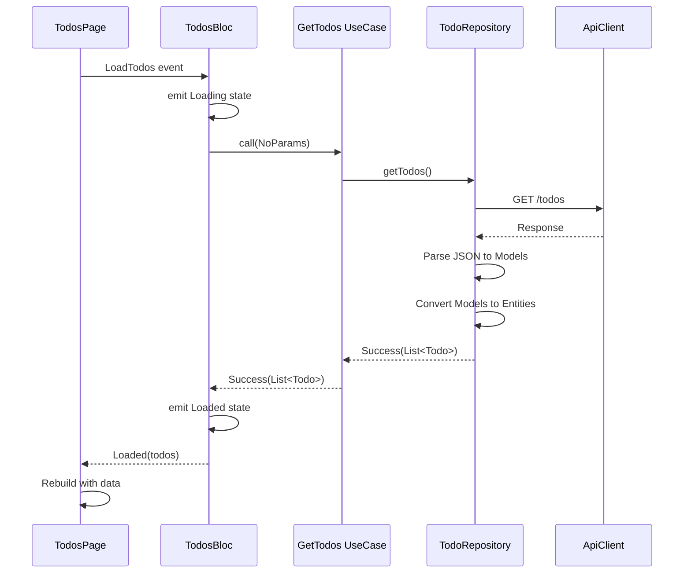
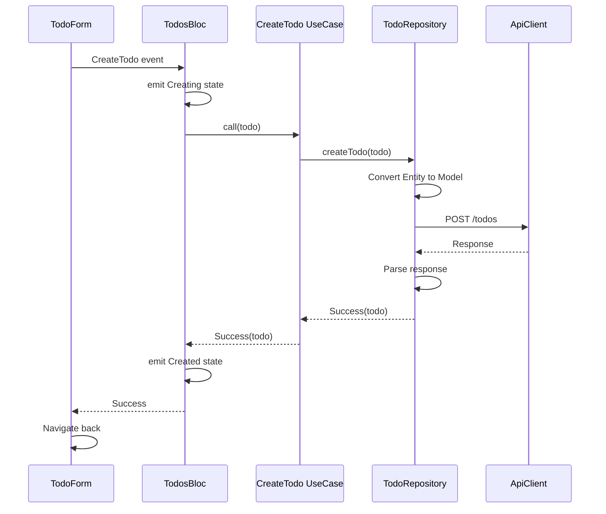
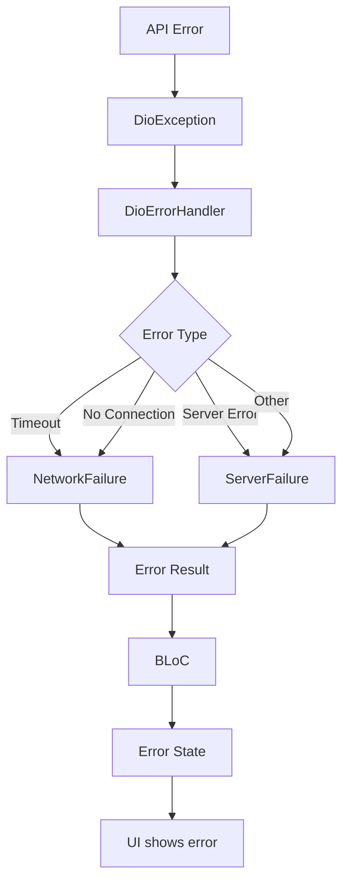
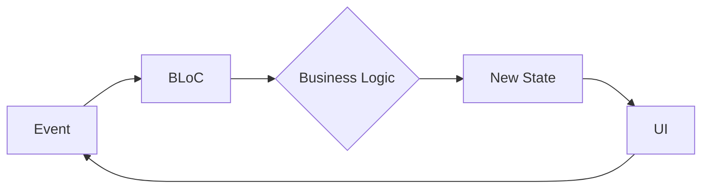
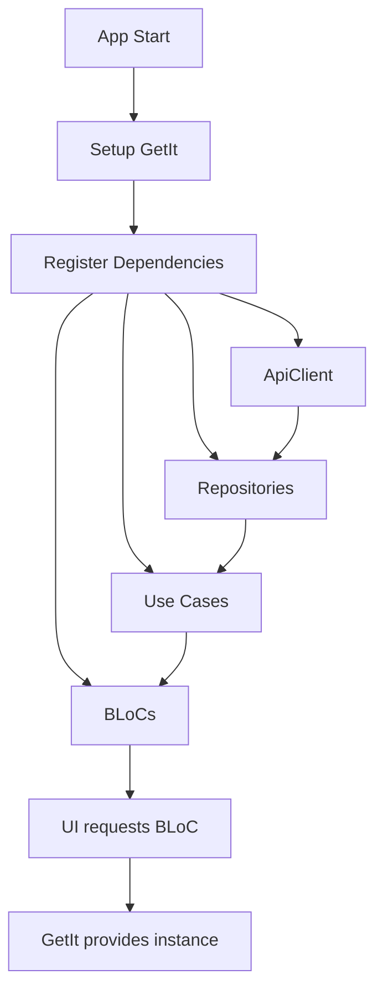

# Data Flow

Understanding how data flows through the Flutter Boilerplate application.

## Overview

Data flows through three main layers following Clean Architecture principles:

```
UI ↔ BLoC ↔ Use Case ↔ Repository ↔ API
```

## Query Flow (Reading Data)

### Step-by-Step Example: Loading Todos



### Code Example

**1. UI triggers event**:
```dart
class TodosPage extends StatelessWidget {
  @override
  Widget build(BuildContext context) {
    return BlocProvider(
      create: (_) => getIt<TodosBloc>()
        ..add(const TodosEvent.loadTodos()), // Trigger
      child: // ... UI
    );
  }
}
```

**2. BLoC handles event**:
```dart
class TodosBloc extends Bloc<TodosEvent, TodosState> {
  final GetTodos getTodos;

  Future<void> _onLoadTodos(event, emit) async {
    emit(const TodosState.loading()); // Emit loading
    
    final result = await getTodos(NoParams()); // Call use case
    
    switch (result) {
      case Success(data: final todos):
        emit(TodosState.loaded(todos)); // Emit success
      case Error(failure: final error):
        emit(TodosState.error(error.message)); // Emit error
    }
  }
}
```

**3. Use Case executes**:
```dart
@injectable
class GetTodos implements UseCase<List<Todo>, NoParams> {
  final TodoRepository repository;

  GetTodos(this.repository);

  @override
  Future<Result<List<Todo>>> call(NoParams params) {
    return repository.getTodos(); // Delegate to repository
  }
}
```

**4. Repository fetches data**:
```dart
@Injectable(as: TodoRepository)
class TodoRepositoryImpl implements TodoRepository {
  final ApiClient _apiClient;

  @override
  Future<Result<List<Todo>>> getTodos() async {
    try {
      final response = await _apiClient.get('/todos'); // API call
      
      final todos = (response.data as List)
          .map((json) => TodoModel.fromJson(json)) // Parse JSON
          .map((model) => model.toEntity()) // Convert to Entity
          .toList();
          
      return Success(todos); // Return success
    } on DioException catch (e) {
      return Error(DioErrorHandler.handleDioError(e)); // Handle error
    }
  }
}
```

**5. UI rebuilds**:
```dart
BlocBuilder<TodosBloc, TodosState>(
  builder: (context, state) {
    return state.when(
      initial: () => const SizedBox(),
      loading: () => const CircularProgressIndicator(),
      loaded: (todos) => ListView.builder(
        itemCount: todos.length,
        itemBuilder: (context, index) => TodoItem(todos[index]),
      ),
      error: (message) => Text('Error: $message'),
    );
  },
)
```

## Command Flow (Writing Data)

### Step-by-Step Example: Creating a Todo



### Code Example

**1. UI triggers event**:
```dart
ElevatedButton(
  onPressed: () {
    context.read<TodosBloc>().add(
      TodosEvent.createTodo(
        Todo(title: 'New todo', completed: false),
      ),
    );
  },
  child: const Text('Create'),
)
```

**2. BLoC handles event**:
```dart
Future<void> _onCreateTodo(event, emit) async {
  emit(const TodosState.creating());
  
  final result = await createTodo(event.todo);
  
  switch (result) {
    case Success():
      emit(const TodosState.created());
      add(const TodosEvent.loadTodos()); // Reload list
    case Error(failure: final error):
      emit(TodosState.error(error.message));
  }
}
```

**3. Use Case executes**:
```dart
@injectable
class CreateTodo implements UseCase<void, Todo> {
  final TodoRepository repository;

  CreateTodo(this.repository);

  @override
  Future<Result<void>> call(Todo params) {
    return repository.createTodo(params);
  }
}
```

**4. Repository sends data**:
```dart
@override
Future<Result<void>> createTodo(Todo todo) async {
  try {
    final model = TodoModel.fromEntity(todo); // Convert to Model
    await _apiClient.post('/todos', data: model.toJson()); // API call
    return const Success(null);
  } on DioException catch (e) {
    return Error(DioErrorHandler.handleDioError(e));
  }
}
```

## Error Handling Flow



### Error Handling Example

```dart
// Repository
try {
  final response = await _apiClient.get('/todos');
  return Success(data);
} on DioException catch (e) {
  return Error(DioErrorHandler.handleDioError(e)); // Convert to Failure
} catch (e) {
  return Error(ServerFailure(e.toString()));
}

// BLoC
switch (result) {
  case Success(data: final todos):
    emit(TodosState.loaded(todos));
  case Error(failure: final error):
    emit(TodosState.error(error.message)); // Show error message
}

// UI
state.when(
  error: (message) => SnackBar(
    content: Text(message),
    backgroundColor: Colors.red,
  ),
  // ... other states
)
```

## State Management Flow

### BLoC Pattern



### State Transitions

```dart
// Initial state
TodosState.initial()

// User action
→ TodosEvent.loadTodos()

// Loading state
→ TodosState.loading()

// Success or Error
→ TodosState.loaded(todos)
→ TodosState.error(message)
```

## Dependency Injection Flow



### DI Example

```dart
// Registration (auto-generated)
@injectable
class TodoRepositoryImpl implements TodoRepository {
  final ApiClient _apiClient; // Injected
  TodoRepositoryImpl(this._apiClient);
}

// Usage
final bloc = getIt<TodosBloc>(); // GetIt resolves all dependencies
```

## Data Transformation Flow

```
API Response (JSON)
    ↓
TodoModel.fromJson()
    ↓
TodoModel
    ↓
model.toEntity()
    ↓
Todo (Entity)
    ↓
UI Display
```

### Transformation Example

```dart
// 1. API returns JSON
{"id": 1, "title": "Buy milk", "completed": false}

// 2. Parse to Model
final model = TodoModel.fromJson(json);

// 3. Convert to Entity
final entity = model.toEntity();

// 4. Use in UI
Text(entity.title) // "Buy milk"
```

## Best Practices

1. **Unidirectional Flow**: Data flows in one direction
2. **Immutable State**: States are immutable
3. **Single Source of Truth**: BLoC holds the state
4. **Error Handling**: Handle errors at every layer
5. **Type Safety**: Use Result<T> for error handling

## Learn More

- [Clean Architecture](clean-architecture.md)
- [State Management](../features/state-management.md)
- [Testing](../development/testing.md)
