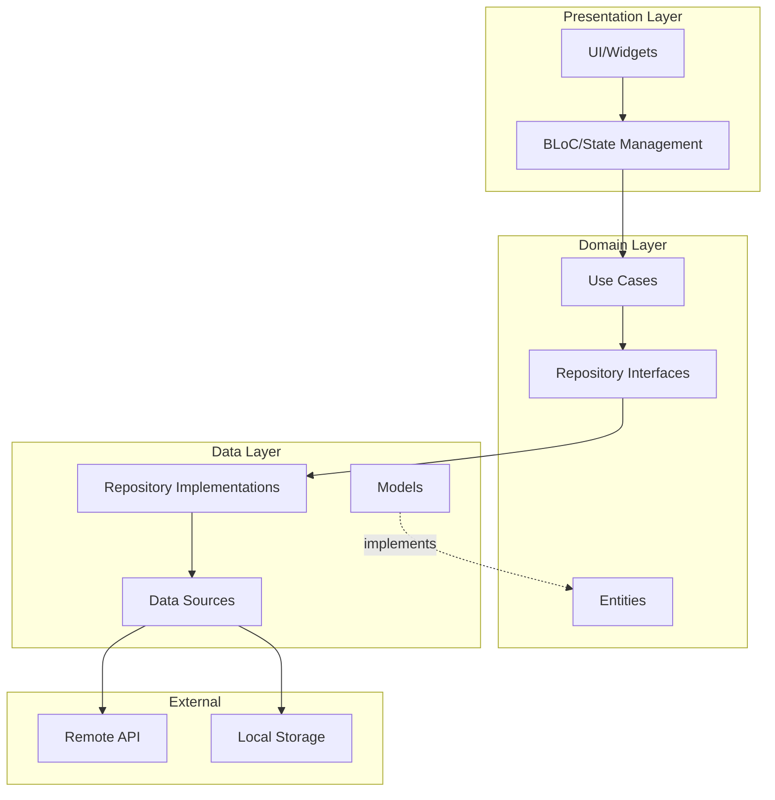

# Architecture Overview

Flutter Boilerplate is built on **Clean Architecture** principles, ensuring separation of concerns, testability, and maintainability.

## Clean Architecture Layers



## Layer Responsibilities

### 🎨 Presentation Layer

**Location**: `lib/features/*/presentation/`

Handles UI and user interactions. Contains:

- **Pages**: Full-screen views
- **Widgets**: Reusable UI components
- **BLoC**: State management and business logic coordination

**Key Principle**: The presentation layer should only handle UI logic, delegating business logic to use cases.

### 🎯 Domain Layer

**Location**: `lib/features/*/domain/`

The core business logic layer. Contains:

- **Entities**: Business objects (pure Dart classes)
- **Use Cases**: Single-responsibility business operations
- **Repository Interfaces**: Abstract data access contracts

**Key Principle**: This layer has NO dependencies on other layers and contains pure business logic.

### 📦 Data Layer

**Location**: `lib/features/*/data/`

Handles data operations and external communications. Contains:

- **Models**: Data transfer objects with JSON serialization
- **Repository Implementations**: Concrete implementations of domain repositories
- **Data Sources**: API clients, local storage, etc.

**Key Principle**: This layer implements the interfaces defined in the domain layer.

## Dependency Rule

Dependencies flow **inward** only:

```
Presentation → Domain ← Data
```

- Presentation depends on Domain
- Data depends on Domain
- Domain depends on nothing (pure Dart)

## Example: Todo Feature

```
lib/features/todos/
├── data/
│   ├── datasources/
│   │   ├── todo_local_data_source.dart
│   │   └── todo_remote_data_source.dart
│   ├── models/
│   │   └── todo_model.dart
│   └── repositories/
│       └── todo_repository_impl.dart
├── domain/
│   ├── entities/
│   │   └── todo.dart
│   ├── repositories/
│   │   └── todo_repository.dart
│   └── usecases/
│       ├── get_todos.dart
│       ├── create_todo.dart
│       └── delete_todo.dart
└── presentation/
    ├── bloc/
    │   ├── todo_bloc.dart
    │   ├── todo_event.dart
    │   └── todo_state.dart
    ├── pages/
    │   └── todos_page.dart
    └── widgets/
        └── todo_item.dart
```

## Benefits

✅ **Testability**: Each layer can be tested independently  
✅ **Maintainability**: Clear separation of concerns  
✅ **Scalability**: Easy to add new features  
✅ **Flexibility**: Easy to swap implementations  
✅ **Independence**: Business logic independent of frameworks

## Learn More

- [Clean Architecture Details](clean-architecture.md)
- [Project Structure](project-structure.md)
- [Data Flow](data-flow.md)
