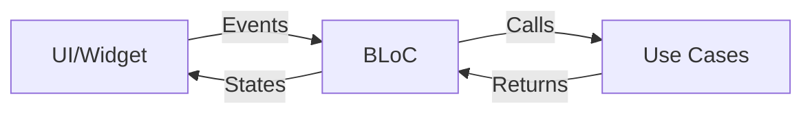

# State Management

Flutter Boilerplate uses the **BLoC (Business Logic Component)** pattern for state management, implemented with the `flutter_bloc` package.

## Why BLoC?

- ✅ **Separation of Concerns**: Business logic separated from UI
- ✅ **Testability**: Easy to test business logic independently
- ✅ **Predictability**: Unidirectional data flow
- ✅ **Scalability**: Works well for large applications
- ✅ **Community Support**: Well-documented and widely adopted

## BLoC Architecture



## Core Concepts

### Events

Events represent user actions or system triggers:

```dart
part of 'auth_bloc.dart';

@freezed
class AuthEvent with _$AuthEvent {
  const factory AuthEvent.loginRequested({
    required String email,
    required String password,
  }) = _LoginRequested;
  
  const factory AuthEvent.logoutRequested() = _LogoutRequested;
  
  const factory AuthEvent.checkAuthStatus() = _CheckAuthStatus;
}
```

### States

States represent the UI state at any given time:

```dart
part of 'auth_bloc.dart';

@freezed
class AuthState with _$AuthState {
  const factory AuthState.initial() = _Initial;
  const factory AuthState.loading() = _Loading;
  const factory AuthState.authenticated(User user) = _Authenticated;
  const factory AuthState.unauthenticated() = _Unauthenticated;
  const factory AuthState.error(String message) = _Error;
}
```

### BLoC

The BLoC handles events and emits states:

```dart
@injectable
class AuthBloc extends Bloc<AuthEvent, AuthState> {
  final LoginUseCase loginUseCase;
  final LogoutUseCase logoutUseCase;

  AuthBloc({
    required this.loginUseCase,
    required this.logoutUseCase,
  }) : super(const AuthState.initial()) {
    on<_LoginRequested>(_onLoginRequested);
    on<_LogoutRequested>(_onLogoutRequested);
  }

  Future<void> _onLoginRequested(
    _LoginRequested event,
    Emitter<AuthState> emit,
  ) async {
    emit(const AuthState.loading());
    
    final result = await loginUseCase(
      LoginParams(email: event.email, password: event.password),
    );
    
    result.fold(
      (failure) => emit(AuthState.error(failure.message)),
      (user) => emit(AuthState.authenticated(user)),
    );
  }
}
```

## Using BLoC in UI

### 1. Provide the BLoC

```dart
BlocProvider(
  create: (context) => getIt<AuthBloc>(),
  child: LoginPage(),
)
```

### 2. Dispatch Events

```dart
context.read<AuthBloc>().add(
  AuthEvent.loginRequested(
    email: emailController.text,
    password: passwordController.text,
  ),
);
```

### 3. Listen to States

```dart
BlocBuilder<AuthBloc, AuthState>(
  builder: (context, state) {
    return state.when(
      initial: () => const SizedBox(),
      loading: () => const CircularProgressIndicator(),
      authenticated: (user) => Text('Welcome ${user.name}'),
      unauthenticated: () => const LoginForm(),
      error: (message) => Text('Error: $message'),
    );
  },
)
```

## BLoC Patterns

### BlocBuilder

Rebuilds UI when state changes:

```dart
BlocBuilder<TodoBloc, TodoState>(
  builder: (context, state) {
    // Build UI based on state
  },
)
```

### BlocListener

Performs side effects when state changes:

```dart
BlocListener<AuthBloc, AuthState>(
  listener: (context, state) {
    state.whenOrNull(
      error: (message) => ScaffoldMessenger.of(context).showSnackBar(
        SnackBar(content: Text(message)),
      ),
    );
  },
  child: YourWidget(),
)
```

### BlocConsumer

Combines BlocBuilder and BlocListener:

```dart
BlocConsumer<AuthBloc, AuthState>(
  listener: (context, state) {
    // Handle side effects
  },
  builder: (context, state) {
    // Build UI
  },
)
```

## Best Practices

### 1. Keep BLoCs Focused

Each BLoC should handle a single feature or concern:

```dart
// ✅ Good: Focused on authentication
class AuthBloc extends Bloc<AuthEvent, AuthState> {}

// ❌ Bad: Handles too many concerns
class AppBloc extends Bloc<AppEvent, AppState> {}
```

### 2. Use Freezed for Immutability

Always use Freezed for events and states:

```dart
@freezed
class TodoEvent with _$TodoEvent {
  const factory TodoEvent.load() = _Load;
}
```

### 3. Delegate to Use Cases

BLoCs should delegate business logic to use cases:

```dart
// ✅ Good
Future<void> _onLoad(_Load event, Emitter<TodoState> emit) async {
  final result = await getTodos(NoParams());
  // Handle result
}

// ❌ Bad: Business logic in BLoC
Future<void> _onLoad(_Load event, Emitter<TodoState> emit) async {
  final response = await http.get(url);
  final todos = parseTodos(response);
  // ...
}
```

### 4. Handle All States

Always handle all possible states:

```dart
state.when(
  initial: () => /* ... */,
  loading: () => /* ... */,
  loaded: (data) => /* ... */,
  error: (message) => /* ... */,
)
```

## Testing BLoCs

Use `bloc_test` for easy BLoC testing:

```dart
blocTest<AuthBloc, AuthState>(
  'emits [loading, authenticated] when login succeeds',
  build: () => AuthBloc(loginUseCase: mockLoginUseCase),
  act: (bloc) => bloc.add(
    AuthEvent.loginRequested(email: 'test@test.com', password: 'pass'),
  ),
  expect: () => [
    const AuthState.loading(),
    AuthState.authenticated(mockUser),
  ],
);
```

## Learn More

- [Official BLoC Documentation](https://bloclibrary.dev/)
- [Adding a Feature](../guides/adding-feature.md)
- [Testing Guide](../development/testing.md)
